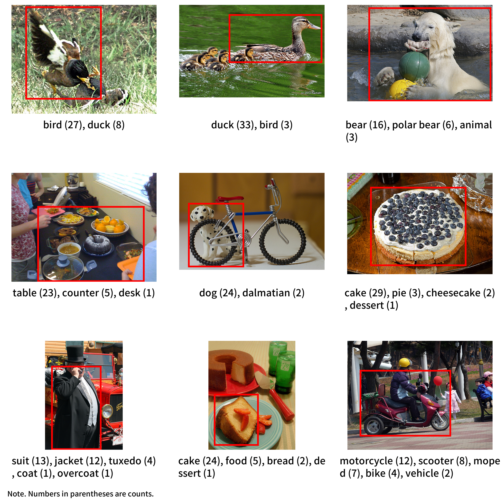

# ManyNames
Repository for the ManyNames dataset (version 2.2) for English and Mandarin Chinese. The English version of ManyNames provides ca. 36 name annotations for each of 25K objects in images selected from VisualGenome, whereas the Chinese version provides approximately 20 name annotations for 1319 objects in images selected from ManyNames. For an illustration see the image below.



For details of the data collection see [Silberer, Zarrieß, & Boleda, 2020](https://aclanthology.org/2020.lrec-1.710/) (version 1.0) and [Silberer, Zarrieß, Westera, & Boleda, 2020](https://aclanthology.org/2020.coling-main.172/) (version 2.0), and [He, Liao, Liang, & Boleda, 2023](https://aclanthology.org/2023.conll-1.30/) (Mandarin Chinese version). For changes in the present version see the [release notes](https://github.com/amore-upf/manynames/blob/master/release_notes_v2.2.md). Previous versions of the dataset can be accessed as older releases in this repository.

## Notation
|Abbreviation | Description |
| -------- |  -------- |
|MN| ManyNames  |
|WN| WordNet  |
|VG| VisualGenome  |
|domain| Categorisation of objects into *people*, *animals_plants*, *vehicles*, *food*, *home*, *buildings*, and *clothing* |

For each domain, there exists at least one WordNet category out of *article of clothing*, *instrumentality, instrumentation*, *person*, *tableware*, *ware*, *food, nutrient*, *structure, construction*, *animal*, *tool*, *food, solid food*, *plant, flora, plant life*, *vehicle*.

## Data files
The dataset is provided in two formats:

* **TSV**: tab-separated text file, first row contains the column labels, nested data is stored as python dictionaries (i.e., "{key: value}")
* **JSON**: the same data set in .json format to facilitate access (to the nested data) outside of python. Included in subfolder *other_data*

The columns that are included for both languages are labelled as follows. The most important columns are listed first.

| Column | Type | Description |
| -------- | :-------: | -------- |
| ***vg_object_id*** | ***int*** | ***The VG id of the object*** |
| ***link_mn*** | ***str*** | ***The url to the image, with the object marked*** |
| ***topname*** | ***str*** | ***The most frequent name of the object in the largest cluster*** |
| ***responses*** | ***dict*** | ***Correct responses and their counts*** |
| mn_bbox_xywh | list| The coordinates of the object in the ManyNames version of the image: "[left x, bottom y, width, height]"; y=0 is at the top of the image.
| vg_image_id | int | The VG id of the image |
| vg_obj_name | str | The VG name of the object |
| vg_domain | str | The MN domain of the VG name, which may be a superset of its WN category (vg_cat). <br>Example: The MN domain *food* subsumes the WN categories *food, solid food* and *food, nutrient*. |
| vg_synset | str | The WN synset of the object, provided by VG |
| domain | str | The MN domain of the object |
| N | int | The number of types in the MN responses |
| total_responses | int | Sum count of correct responses |
| perc_top | float | The relative frequency of the topname (among correct responses)|
| H | float | The H agreement measure from Snodgrass and Vanderwart (1980) |

The English ManyNames dataset also includes the columns listed below.

| Column | Type | Description |
| -------- | :-------: | -------- |
| link_vg | str | The url to the image in VG |
| incorrect | dict | Incorrect responses and their counts |
| split | str | Use of the image in training vs. test vs. validation in [Silberer, Zarrieß, Westera, & Boleda, 2020](https://aclanthology.org/2020.coling-main.172/) |

In the case of the Chinese ManyNames dataset, it includes as well the following columns.

| Column | Type | Description |
| -------- | :-------: | -------- |
|  list  |  str | Lists of images assigned to participants |
| familiarity | float | Weighted average of corpus-frequency of responses |

Besides, the English ManyNames dataset contains a file named ***additional-info-en.tsv***, composed of the additional columns in the following table.

| Column | Type | Description |
| -------- | :-------: | -------- |
| vg_same_object | dict | Same object ratings for the vg_object_name |
| vg_adequacy_mean | str | Mean adequacy rating for the vg_object_name |
| vg_inadequacy_type | dict | Rated inadequacy type for the vg_object_name |
| vg_image_name | str | The name of the VG image |
| vg_cat | str | The WN hypernym of the VG synset, corresponds roughly to one of the 7 MN domains. |
| vg_bbox_xywh | list| The coordinates of the object in the original VG version of the image: "[left x, bottom y, width, height]"; y=0 is at the top of the image. |
| clusters | dict | Response clusters and total count per cluster |
| same_object | dicts | Mean same-object ratings for response pairs |
| adequacy_mean | dict | Mean adequacy ratings for MN responses |
| inadequacy_type | dict | Rated inadequacy rating for MN responses |


## Subfolder: scripts/

### Python scripts
The python scripts require the following packages:
  * `pandas` for `manynames.py`, `agreement_table.py`, `plot_distr_topnames.py` and `visualise.py`
  * `skimage` (for `visualise.py`)
  * `matplotlib.pyplot` (for `agreement_table.py`, `plot_distr_topnames.py` and `visualise.py`)
  * `PIL` (for `create_MN_images.py`, `download_MN_images.py`)
  * `tqdm` (for `create_MN_images.py`, `download_MN_images.py`)

The scripts can be run from the command line. Use `python <script-name> -h` for more information.

* **`manynames.py`**
  *Loads the MN data into a pandas DataFrame.*<br>
* **`visualise.py`**
  *Provides a function to draw the bounding box around the target object and label it with its MN object names (and VG name).*
* **`agreement_table.py`**
  *Creates a summary table of name agreement indices (reproducing Table 3 in [Silberer, Zarrieß, & Boleda (2020)](https://aclanthology.org/2020.lrec-1.710/) with the v2.1 data).*<br>
* **`plot_distr_topnames.py`**
  *Creates a stacked box plot, showing the distribution of MN topnames per domain (reproducing Figure 3 in [Silberer, Zarrieß, & Boleda (2020)](https://aclanthology.org/2020.lrec-1.710/) with the v2.1 data).*<br>
* **`create_MN_images.py`**
  *Creates the images as stored under manynames.upf.edu from their VG-source.*<br>
* **`download_MN_images.py`**
  *Downloads a subset of images from manynames.upf.edu*<br>
* **`showExamples.py`**
  *Annotates and displays subsets of MN-images.*<br>

### R scripts
The R-script **`download_MN_images`** can be used, as its Python counterpart, to download a subset of images from manynames.upf.edu.

## Version history
* **version 2.2**: Added all singletons responses (given only once and not synonyms or hypernyms of the topname)

* **version 2.1.1**: Added bounding box coordinates for ManyNames image versions. Updated image links to new domain: manynames.upf.edu

* **version 2.1**: Corrections to topname and domain definitions, inclusion of some singleton responses (for details see [release notes](https://github.com/amore-upf/manynames/blob/master/release_notes_v2.1.md)

* **version 2.0**: Integration of name verification data (for details see [Silberer, Zarrieß, Westera, & Boleda, 2020](https://aclanthology.org/2020.coling-main.172/))

* **version 1.0**: Initial release (for details see [Silberer, Zarrieß, & Boleda, 2020](https://aclanthology.org/2020.lrec-1.710/))


## Citing ManyNames
Silberer, C., S. Zarrieß, G. Boleda. 2020. [Object Naming in Language and Vision: A Survey and a New Dataset](https://aclanthology.org/2020.lrec-1.710/). Proceedings of the 12th International Conference on Language Resources and Evaluation (LREC 2020).

```
@inproceedings{silberer2020manynames,
  title = {{Object Naming in Language and Vision: A Survey and a New Dataset}},
  author = {Silberer, Carina and Zarie{\ss}, Sina and Boleda, Gemma},
  booktitle = {Proceedings of the 12th International Conference on Language Resources and Evaluation (LREC 2020)},
  year = {2020},
  url = {https://aclanthology.org/2020.lrec-1.710/},
}
```

Silberer, C., S. Zarrieß, M. Westera, G. Boleda. 2020. [Humans meet models on object naming: A new dataset and analysis](https://aclanthology.org/2020.coling-main.172/). Proceedings of the 28th International Conference on Computational Linguistics.

```
@inproceedings{silberer-etal-2020-humans,
    title = "Humans Meet Models on Object Naming: A New Dataset and Analysis",
    author = "Silberer, Carina and Zarrie{\ss}, Sina and Westera, Matthijs and Boleda, Gemma",
    booktitle = "Proceedings of the 28th International Conference on Computational Linguistics",
    year = "2020",
    url = "https://aclanthology.org/2020.coling-main.172",
    doi = "10.18653/v1/2020.coling-main.172",
}
```

He, Y., Liao, X., Liang, J., Boleda, G. 2023. [The Impact of Familiarity on Naming Variation: A Study on Object Naming in Mandarin Chinese](https://aclanthology.org/2023.conll-1.30/). Proceedings of the 27th Conference on Computational Natural Language Learning (CoNLL)

```
@inproceedings{he-etal-2023-impact,
    title = "The Impact of Familiarity on Naming Variation: A Study on Object Naming in {M}andarin {C}hinese",
    author = "He, Yunke and Liao, Xixian and Liang, Jialing and Boleda, Gemma",
    booktitle = "Proceedings of the 27th Conference on Computational Natural Language Learning (CoNLL)",
    year = "2023",
    url = "https://aclanthology.org/2023.conll-1.30",
    doi = "10.18653/v1/2023.conll-1.30",
}
```

## About
ManyNames is licensed under a [Creative Commons Attribution 4.0 International License](https://creativecommons.org/licenses/by/4.0/), and based on  VisualGenome at [visualgenome.org](https://visualgenome.org).


This project has received funding from the European Research Council (ERC) under the European Union's Horizon 2020 research and innovation programme (grant agreement No 715154).
