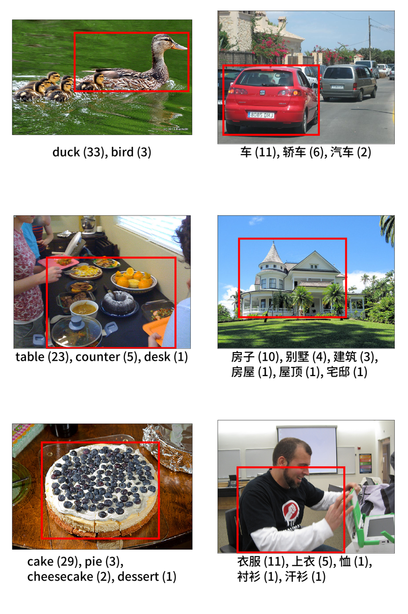

# ManyNames
Repository for the ManyNames dataset (version 2.3) for English and Mandarin Chinese. The English version of ManyNames provides ca. 31 name annotations for each of 25K objects in images selected from VisualGenome, whereas the Chinese version provides approximately 20 name annotations for 1319 objects in images selected from ManyNames. For an illustration, see the image below.

<p align="center">
  
</p>

For details about the data collection and the information in the dataset, see [Silberer, Zarrieß, & Boleda, 2020](https://aclanthology.org/2020.lrec-1.710/) (version 1.0) and [Silberer, Zarrieß, Westera, & Boleda, 2020](https://aclanthology.org/2020.coling-main.172/) (version 2.0), and [He, Liao, Liang, & Boleda, 2023](https://aclanthology.org/2023.conll-1.30/) (Mandarin Chinese version). For changes in the present version see the [release notes](https://github.com/amore-upf/manynames/blob/master/release_notes_v2.2.md). Previous versions of the dataset can be accessed as older releases in this repository.


## Data files
The data are provided in two formats:

* **TSV**: tab-separated text files, first row contains the column labels, nested data is stored as python dictionaries (i.e., "{key: value}"). Available in this folder.
* **JSON**: the same data set in .json format to facilitate access (to the nested data) outside of python. Included in subfolder *other_data*.

The columns that are included for **both the English and Mandarin Chinese datasets** are labelled as follows.

| Column | Type | Description |
| -------- | :-------: | -------- |
| vg_object_id | int | The VisualGenome ID of the object (functions as the unique ID for the datapoints in ManyNames)|
| vg_image_id | int | The VisualGenome ID of the image (is also unique)|
| vg_obj_name | str | The VG name of the object |
| topname | str | The most frequent name produced by subjects for the object |
| responses | dict | Correct responses and their counts |
| domain | str | The ManyNames domain of the object, i.e. categorisation of objects into *people*, *animals_plants*, *vehicles*, *food*, *home*, *buildings*, and *clothing* |
| vg_domain | str | The ManyNames domain of the VG name, which may be a superset of its WordNet category (encoded in column vg_cat). Example: The ManyNames domain *food* subsumes the WordNet categories *food, solid food*, and *food, nutrient*. |
| N | int | The number of name types in the ManyNames responses (each name counts once) |
| total_responses | int | Sum count of correct responses (tokens; each subject production of a name counts once)|
| perc_top | float | The relative frequency of the topname (among correct responses), in percentage|
| H | float | The H agreement measure from Snodgrass and Vanderwart (1980), which is the entropy over subject responses |
| vg_synset | str | The WordNet synset of the object, as provided by VisualGenome  |
| link_mn | str | The url to the image with the object marked|
| vg_bbox_xywh | list| The coordinates of the object: "[left x, bottom y, width, height]"; y=0 is at the top of the image|

&nbsp;

The **English** dataset also includes the columns listed below.

| Column | Type | Description |
| -------- | :-------: | -------- |
| incorrect | dict | Incorrect responses and their counts |
| split | str | Use of the image in training vs. test vs. validation in [Silberer, Zarrieß, Westera, & Boleda, 2020](https://aclanthology.org/2020.coling-main.172/) |
|synsets| dict | Correct responses and their [WordNet](https://wordnet.princeton.edu/) synset, assigned automatically|

&nbsp;

The **Mandarin Chinese** dataset also includes the columns listed below.

| Column | Type | Description |
| -------- | :-------: | -------- |
|  list  |  str | Lists of images assigned to participants |
| familiarity | float | Familiarity approximated as the weighted average of the frequency of the responses in a textual corpus |

*Note*: A subset of the ManyNames data has also been annotated for Catalan within the [AINA project](https://projecteaina.cat/). It is available [here](https://huggingface.co/datasets/projecte-aina/cat_manynames).

## Subfolder: other-data/

Contains the ManyNames datasets in JSON format, some files with additional information about the English ManyNames dataset, and also files with lexical information (concreteness, familiarity, imageability, age of acquisition, frequency...) for each name in ManyNames and for both languages. See the README inside the folder for more information.

## Subfolder: scripts/

Contains scripts to facilitate processing ManyNames and to reproduce tables and figures from publications about ManyNames. See the README inside the folder for more information.

## Citing ManyNames / attribution
* For **any use** of ManyNames:

Silberer, C., S. Zarrieß, G. Boleda. 2020. [Object Naming in Language and Vision: A Survey and a New Dataset](https://aclanthology.org/2020.lrec-1.710/). Proceedings of the 12th International Conference on Language Resources and Evaluation (LREC 2020), 5792-5801.

```
@inproceedings{silberer2020manynames,
  title = {{Object Naming in Language and Vision: A Survey and a New Dataset}},
  author = {Silberer, Carina and Zarie{\ss}, Sina and Boleda, Gemma},
  booktitle = {Proceedings of the 12th International Conference on Language Resources and Evaluation (LREC 2020)},
  year = {2020},
  url = {https://aclanthology.org/2020.lrec-1.710/},
  pages = "5792--5801"
}
```

* In addition, if you refer to anything specific to version 1 of ManyNames:

Silberer, C., S. Zarrieß, M. Westera, G. Boleda. 2020. [Humans meet models on object naming: A new dataset and analysis](https://aclanthology.org/2020.coling-main.172/). Proceedings of the 28th International Conference on Computational Linguistics, 1893-1905.

```
@inproceedings{silberer-etal-2020-humans,
    title = "Humans Meet Models on Object Naming: A New Dataset and Analysis",
    author = "Silberer, Carina and Zarrie{\ss}, Sina and Westera, Matthijs and Boleda, Gemma",
    booktitle = "Proceedings of the 28th International Conference on Computational Linguistics",
    year = "2020",
    url = "https://aclanthology.org/2020.coling-main.172",
    doi = "10.18653/v1/2020.coling-main.172",
    pages = "1893--1905"
}
```

* In addition, if you use the data for Mandarin Chinese:

He, Y., Liao, X., Liang, J., Boleda, G. 2023. [The Impact of Familiarity on Naming Variation: A Study on Object Naming in Mandarin Chinese](https://aclanthology.org/2023.conll-1.30/). Proceedings of the 27th Conference on Computational Natural Language Learning (CoNLL), 456-475.

```
@inproceedings{he-etal-2023-impact,
    title = "The Impact of Familiarity on Naming Variation: A Study on Object Naming in {M}andarin {C}hinese",
    author = "He, Yunke and Liao, Xixian and Liang, Jialing and Boleda, Gemma",
    booktitle = "Proceedings of the 27th Conference on Computational Natural Language Learning (CoNLL)",
    year = "2023",
    url = "https://aclanthology.org/2023.conll-1.30",
    doi = "10.18653/v1/2023.conll-1.30",
    pages = "456--475"
}
```

## Version history

(For more information about versions 2.1 onward, see the [release notes](https://github.com/amore-upf/manynames/blob/master/release_notes_v2.2.md).)

* **version 2.3**: **Revised English singletons after identifying issues in v2.2; added Wordnet synset for English names; added anonymized subject IDs for English data; enhanced lexical data for English and Mandarin Chinese**.

* **version 2.2**: Added all singletons responses for English (= responses given only once) following a manual correction procedure; added Mandarin Chinese names for a subset of the data; added lexical information for names.

* **version 2.1.1**: Added bounding box coordinates for ManyNames image versions. Updated image links to new domain: manynames.upf.edu.

* **version 2.1**: Corrections to topname and domain definitions, inclusion of some singleton responses.

* **version 2.0**: Integration of name verification data (for details, see [Silberer, Zarrieß, Westera, & Boleda, 2020](https://aclanthology.org/2020.coling-main.172/)).

* **version 1.0**: Initial release (for details, see [Silberer, Zarrieß, & Boleda, 2020](https://aclanthology.org/2020.lrec-1.710/)).

## About
ManyNames is licensed under a [Creative Commons Attribution 4.0 International License](https://creativecommons.org/licenses/by/4.0/), and based on  VisualGenome at [visualgenome.org](https://visualgenome.org).

This project has received funding from the European Research Council (ERC) under the European Union's Horizon 2020 research and innovation programme (grant agreement No 715154).
