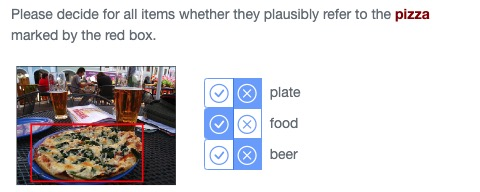
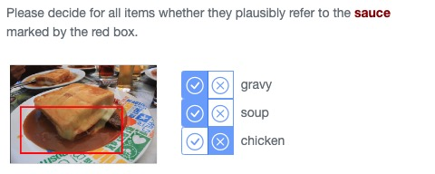

# Release Notes
## ManyNames v2.2

The following changes have been introduced in version 2.2:

* Singletons (names that were produced only once for a given object) have been verified.

* Names in Mandarin Chinese for a subset of the data have been added.

* Lexical information for the names in the English and Mandarin Chinese data has been added.

* Data has been reorganized and some scripts have been updated so as to facilitate use of ManyNames.

### Singleton verification

**Problem**: while in ManyNames v.2.1.1 we added some singleton responses (those that according to WordNet were synonyms or hypernyms of the topname) to the other correct responses, the remaining singletons were left in the *singletons* column, which potentially excluded viable object names. (*Note*: singletons were not included in the manual cleaning procedure that led from v. 1 to v. 2 because of time and budget constraints.)

**Solution**: classification of items in *singleton* as correct or incorrect via automatic filtering followed by manual verification, as explained next.

### Before verification: re-generating MNv2.1

Since we spotted some issues in MNv2.1, we first repeated the procedure that went from MNv2 to MNv2.1 with some improvements. The MNv2 => MNv2.1 process addressed some problematic issues regarding the definition of top names and domains and well as the treatment of spelling variants; adjusted the treatment of singleton responses; and simplified the structure of the data columns detailing the verification data to ease accessibility (full description of the process [here](https://github.com/amore-upf/manynames/blob/master/release_notes_v2.1.md)). The improvements we made in this release are the following: ***, but improving some aspects of them; e.g., we made sure to correct spelling mistakes in the singletons column as well (because of a bug, this was not done properly in the previous MNv2.1). ==> @TO-DO: list all the improvements*** The singletons in the resulting data were subject to the following processing.

#### Automatic filtering
We filtered out singletons that we could safely identify as incorrect without need of manual annotation, therefore adding them to column *incorrect*. This involved two steps:

1. **Filtering of multi-word singletons**: Some singletons consisted of more than one word. Some multi-word expressions, such as "tennis player", are lexicalized, meaning that the individual word components co-occur in language so often that the multi-word expression can be considered a single name; others, like "cute red dress", are not lexicalized. With singletons, we follow the same procedure that we followed with the remaining names: multi-word expressions appearing in the dataset of Muraki, E. J., Abdalla, S., Brysbaert, M., & Pexman, P. M. (2022). [Concreteness ratings for 62 thousand English multiword expressions](https://doi.org/10.31234/osf.io/m397u) were kept for annotation, and the rest were automatically discarded.

2. **Filtering of incorrect parts-of-speech**: We PoS-tagged the singletons with StanfordCoreNLP, and kept all PoS but but RB (adverb), IN (preposition/subordinating conjunction), and FW (foreign word), so as to automatically filter out words that are likely not names. ***@TO-DO, did we filter out expressions containing any of these, or consisting only of these? if it is "containing", why didn't they get removed in step 1?***

**Affected columns**: incorrect, singletons

#### Manual verification

AMT workers were asked whether singletons correctly referred to the relevant MN objects. This process encompassed 21,149 images, organized into 1834 batches launched on AMT, and annotated by 3 people each. More information about the annotation process is included in the Appendix below. ***@PAOLA please put the exact instructions that were given to the turkers in the appendix below***

#### Generating English MNv2.2

After this procedure, we generated a new version of the English portion of ManyNames, where the singletons (originally in column *singletons*) were moved to column *responses*, if 2+ subjects selected them as correct, and to column *incorrect*, otherwise. We also updated the following columns to account for the newly included data:

* N
* total_responses
* perc_top
* H

**Affected columns**: singletons (removed, as it is no longer needed), responses, incorrect, the ones listed just above.

The final version of the English ManyNames (v2.2) is in files `manynames-en.tsv` / `manynames-en.json`. 

### Mandarin Chinese ManyNames

We added the Mandarin Chinese version of ManyNames to this release, by unifying the data in the [initial release](https://github.com/flyingpiggy1214/ManyNames_ZH) with the information in MN. These data consist of approximately 20 name annotations for 1319 objects in images selected from ManyNames. It is found in files `manynames-zh.tsv` / `manynames-zh.json`

***Affected columns***: vg_image_id (added), vg_object_id (added), vg_obj_name (added), vg_domain (added), vg_synset (added), mn_bbox_xywh (added), response (renamed to *responses*), perc_top (added), total_respondes (added)

### Lexical information

We have created a TSV file for each dataset (English and Chinese) including lexical information for each name in the ManyNames datasets. The following measurements are included:
- concreteness
- familiarity
- imageability
- age of acquisition
- frequency per million tokens

This information has been retrieved from several datasets listed [here](https://github.com/amore-upf/manynames/blob/release_v2.2/other-data/README.md).

### Data reorganization, changes to scripts

* We reorganized the information in previous versions by moving some of the columns to file `other-data/additional-info.tsv` and reordering the columns (see the main README.md for which information is where). This was done to facilitate use.

* We converted script `showExamples.r` to Python, resulting in script `showExamples.py`.

* We modified scripts `agreement_table.py`, `plot_distr_topnames.py`, and `showExamples.py` so they automatically create results for the datasets in English and in Chinese.

* We modified scripts `agreement_table.py`, `create_MN_images.py`, `plot_distr_topnames.py`, `showExamples.py`, and `visualise.py` so it retrieves needed columns from `other-data/additional-info.tsv`.

* In script `agreement_table.py`, we deleted columns *top=VG* and *%VG*.

* In script `plot_distr_topnames.py`, we hid y-axis spine and ticks and added a title to the plot.

### APPENDIX: Procedure for the manual verification
#### Instructions given to turkers for manual singleton verification
Your task is to decide, for a list of names, whether they refer to an object of interest. The object of interest is defined by a red bounding box and a name.
For example, in this image the object of interest is named **duck**. The names *bird*, and *animal* refer to the same object as **duck** whereas the names *water*, and *lake* do not.

  

In some cases, given a bounding box, it is not unequivocally clear which object is the target and workers may have provided names for different objects in the same bounding box. We want you to focus only on the object indicated by the name (in red) in the instruction for each image. Please select only names which are plausibly referring to the same object as this name!
 
For example, in this image the names *food*, and *plate* both refer to an object in the bounding box. But only *food* refers to the same object as **pizza**.

  

Sometimes, it is not unequivocally clear what the object in the bounding box is and different workers may have perceived the same object in a different way. We want you to select only names which could plausibly be used to refer to the same object (as shown in the image) even if they can not always be used for the same object.
 
For example, in this image the names *gravy*, and *soup* both plausibly refer to the same object as **sauce**, because it is not unequivocally clear whether the object in the box is *gravy*, or *soup*.

  

&nbsp;
&nbsp;

## ManyNames v2.1.1
Added bounding box coordinates for ManyNames image versions. Updated ManyNames-image links to new domain: [manynames.upf.edu](manynames.upf.edu).
Added scripts for recreating ManyNames images from VG-source and downloading subsets of ManyNames images.

&nbsp;
&nbsp;
&nbsp;

## ManyNames v2.1.0
In version 2.1 we addressed some potentially problematic issues regarding the definition of topnames and domains and well as the treatment of spelling variants. We also adjusted the treatment of singleton responses so that singleton responses which are likely to be correct names for the target object are no longer excluded from name agreement calculation. Finally, we simplified the structure of the data columns detailing the verification data to ease accessibility. Each issue is described in more detail below.

### Definition of topnames and incorrect responses
**Problem**: In ManyNames v2.0 it could happen that a cluster of words referring to the same object *overall* had a higher number of selections than the most frequent name alone. For instance, in a case like: {*giraffe*: 12, *woman*: 10, *person*: 9}, the cluster *woman-person* has a higher number of selections than the cluster *giraffe*.

**Solution**: In these cases, the *topname* is defined as the most frequent name within the largest name cluster (instead of the most frequent name overall). In addition names belonging to the largest cluster are coded as correct (instead of names belonging to the cluster of the most frequent name). In the example above, the topname was changed to *woman* (instead of *giraffe*) and *woman*, *girl*, and *person* are now counted as correct (and *giraffe* as incorrect).

**Affected columns**: clusters (new), topname, responses, incorrect

### Update/correct domains

**Problem**: Some domain definitions may have to be adjusted after updating the topname (see above). In addition, some domain definitions were incorrect or inconsistent across the data set (i.e., images with the same topname could have different domain definitions).

**Solution**: To resolve inconsistencies we now define the domain for each image as the domain in which the respective topname appears most frequently in. In case of a tie, we manually selected the most appropriate domain. For the topname *mouse*, the domain was generally changed from *animals_plants* to *home* (we only have images of the electronic device).

Please note, that for some images/names the most appropriate domain label is not unequivocally clear.

* Some names could be placed into multiple MN domains. This concerns cases like *mirror* (home, vehicles -- in case of a motorcycle mirror), *clock* (home, buildings -- in case of a clock tower), and *banana* (animals_plants, food). For these cases, we just applied the frequency rule.

* The names *sand*, *snow*, *field*, *water*, *grass* were lacking a corresponding MN domain. In order to avoid adding a new (and very sparse) domain label, these names were included into the domain *animals_plants* (which therefore may be more broadly understood as *natural world*).

**Affected columns**: domain

### Spelling variants
**Problem**: Different spellings of noun-noun compounds were so far counted as different names (e.g., 'tea pot' vs 'teapot').

**Solution**: When responses differed only in one white space, the response counts were summed under the most frequent spelling variant.

**Affected columns**: responses

### Treatment of singleton responses
**Problem**: The strict exclusion of all singleton responses can remove viable object names.

**Solution**: Singletons are now treated as a correct response, if they are either *synonyms* or *hypernyms* of the topname, based on WordNet. Accepted singletons are now listed together with the other correct responses in the ***responses*** column, and they are erased from the ***singletons*** column. Non-accepted ones are left in the ***singletons*** column.

**Affected columns**: responses, singletons (overall 3038 singletons are now treated as correct responses).

### Update summary columns
Based on the updated topname and response variables, we have also updated the following columns:

* total_responses (sum of correct responses)
* perc_top percentage (name agreement in %)
* H (name agreement score)
* N (number of response types)

### Update verification data columns

The verification data (same object and adequacy ratings) are now stored for all names (correct and incorrect) in the same columns (see below). The column *incorrect* now only includes the incorrect names with their response counts but no longer their verification data.

* **same_object**: it now contains, for all the naming annotations of each data point (correct and incorrect names), their reciprocal *same object* score. Singletons - which are included in the responses, but for which we do not have a *same object* score - are labelled with “NA”.

* **inadequacy_type**: it now contains, for all the naming annotations of each data point (correct and incorrect names), the corresponding *inadequacy type* information. Singletons - which are included in the responses, but for which we do not have any *inadequacy type* annotations - are labelled with “NA”. Note that, differently, a *inadequacy type* "None", means that annotators have marked that name as totally adequate for the corresponding image.

* **adequacy_mean**: it now contains, for all the naming annotations of each data point (correct and incorrect names), the corresponding *adequacy mean* information. Singletons - which are included in the responses, but for which we do not have any *adequacy mean* annotations - are labelled with “NA”.

&nbsp;
&nbsp;
&nbsp;

## ManyNames v2.0.0
Integration of name verification data (for details see [Silberer, Zarrieß, Westera, & Boleda, 2020](https://github.com/amore-upf/manynames/releases#:~:text=Silberer%2C%20Zarrie%C3%9F%2C%20Westera%2C%20%26%20Boleda%2C%20202))

&nbsp;
&nbsp;
&nbsp;

## ManyNames v1.0.0
Initial release (for details see [Silberer, Zarrieß, Westera, & Boleda, 2020](https://github.com/amore-upf/manynames/releases#:~:text=Silberer%2C%20Zarrie%C3%9F%2C%20Westera%2C%20%26%20Boleda%2C%20202))